# Two-method code-generation pilot

Experiment: `2026-09-05-codegen-pilot-01`. One replicate per prompt and method. Computer use was excluded at the user’s request.

[**Compare KiCad and tscircuit side by side: rule results and score bounds**](scoring.md).

Recorded outcomes: 20 of 20 runs. All raw candidates and reported failures are retained.

First 18 runs used fresh subagents with no forked history. Final two runs were generated by the parent agent after fresh spawning and completed-agent follow-up both failed with agent thread limit reached.

This is an exploratory generation pilot. Completion describes execution, not design correctness. Model settings and token/cost measurements are unavailable; no comparative quality score is claimed. See each run’s result and original validation reports for failures and limitations.

| Prompt | Difficulty | Method | Run status | Files and diagnostics |
| --- | --- | --- | --- | --- |
| led-indicator | easy | kicad-codegen | completed | [Result](../../data/runs/2026-09-05-codegen-pilot-01/led-indicator/kicad-codegen/replicate-1/result.json) · [Files](../../data/runs/2026-09-05-codegen-pilot-01/led-indicator/kicad-codegen/replicate-1/artifacts/README.md) |
| led-indicator | easy | tscircuit-codegen | completed | [Result](../../data/runs/2026-09-05-codegen-pilot-01/led-indicator/tscircuit-codegen/replicate-1/result.json) · [Files](../../data/runs/2026-09-05-codegen-pilot-01/led-indicator/tscircuit-codegen/replicate-1/artifacts/README.md) |
| rc-low-pass | easy | kicad-codegen | completed | [Result](../../data/runs/2026-09-05-codegen-pilot-01/rc-low-pass/kicad-codegen/replicate-1/result.json) · [Files](../../data/runs/2026-09-05-codegen-pilot-01/rc-low-pass/kicad-codegen/replicate-1/artifacts/README.md) |
| rc-low-pass | easy | tscircuit-codegen | completed | [Result](../../data/runs/2026-09-05-codegen-pilot-01/rc-low-pass/tscircuit-codegen/replicate-1/result.json) · [Files](../../data/runs/2026-09-05-codegen-pilot-01/rc-low-pass/tscircuit-codegen/replicate-1/artifacts/README.md) |
| voltage-divider | easy | kicad-codegen | completed | [Result](../../data/runs/2026-09-05-codegen-pilot-01/voltage-divider/kicad-codegen/replicate-1/result.json) · [Files](../../data/runs/2026-09-05-codegen-pilot-01/voltage-divider/kicad-codegen/replicate-1/artifacts/README.md) |
| voltage-divider | easy | tscircuit-codegen | completed | [Result](../../data/runs/2026-09-05-codegen-pilot-01/voltage-divider/tscircuit-codegen/replicate-1/result.json) · [Files](../../data/runs/2026-09-05-codegen-pilot-01/voltage-divider/tscircuit-codegen/replicate-1/artifacts/README.md) |
| button-input-bank | medium | kicad-codegen | completed | [Result](../../data/runs/2026-09-05-codegen-pilot-01/button-input-bank/kicad-codegen/replicate-1/result.json) · [Files](../../data/runs/2026-09-05-codegen-pilot-01/button-input-bank/kicad-codegen/replicate-1/artifacts/README.md) |
| button-input-bank | medium | tscircuit-codegen | completed | [Result](../../data/runs/2026-09-05-codegen-pilot-01/button-input-bank/tscircuit-codegen/replicate-1/result.json) · [Files](../../data/runs/2026-09-05-codegen-pilot-01/button-input-bank/tscircuit-codegen/replicate-1/artifacts/README.md) |
| i2c-pullup-hub | medium | kicad-codegen | completed | [Result](../../data/runs/2026-09-05-codegen-pilot-01/i2c-pullup-hub/kicad-codegen/replicate-1/result.json) · [Files](../../data/runs/2026-09-05-codegen-pilot-01/i2c-pullup-hub/kicad-codegen/replicate-1/artifacts/README.md) |
| i2c-pullup-hub | medium | tscircuit-codegen | completed | [Result](../../data/runs/2026-09-05-codegen-pilot-01/i2c-pullup-hub/tscircuit-codegen/replicate-1/result.json) · [Files](../../data/runs/2026-09-05-codegen-pilot-01/i2c-pullup-hub/tscircuit-codegen/replicate-1/artifacts/README.md) |
| npn-led-driver | medium | kicad-codegen | completed | [Result](../../data/runs/2026-09-05-codegen-pilot-01/npn-led-driver/kicad-codegen/replicate-1/result.json) · [Files](../../data/runs/2026-09-05-codegen-pilot-01/npn-led-driver/kicad-codegen/replicate-1/artifacts/README.md) |
| npn-led-driver | medium | tscircuit-codegen | completed | [Result](../../data/runs/2026-09-05-codegen-pilot-01/npn-led-driver/tscircuit-codegen/replicate-1/result.json) · [Files](../../data/runs/2026-09-05-codegen-pilot-01/npn-led-driver/tscircuit-codegen/replicate-1/artifacts/README.md) |
| stereo-passive-attenuator | medium | kicad-codegen | completed | [Result](../../data/runs/2026-09-05-codegen-pilot-01/stereo-passive-attenuator/kicad-codegen/replicate-1/result.json) · [Files](../../data/runs/2026-09-05-codegen-pilot-01/stereo-passive-attenuator/kicad-codegen/replicate-1/artifacts/README.md) |
| stereo-passive-attenuator | medium | tscircuit-codegen | completed | [Result](../../data/runs/2026-09-05-codegen-pilot-01/stereo-passive-attenuator/tscircuit-codegen/replicate-1/result.json) · [Files](../../data/runs/2026-09-05-codegen-pilot-01/stereo-passive-attenuator/tscircuit-codegen/replicate-1/artifacts/README.md) |
| analog-input-bank | hard | kicad-codegen | completed | [Result](../../data/runs/2026-09-05-codegen-pilot-01/analog-input-bank/kicad-codegen/replicate-1/result.json) · [Files](../../data/runs/2026-09-05-codegen-pilot-01/analog-input-bank/kicad-codegen/replicate-1/artifacts/README.md) |
| analog-input-bank | hard | tscircuit-codegen | completed | [Result](../../data/runs/2026-09-05-codegen-pilot-01/analog-input-bank/tscircuit-codegen/replicate-1/result.json) · [Files](../../data/runs/2026-09-05-codegen-pilot-01/analog-input-bank/tscircuit-codegen/replicate-1/artifacts/README.md) |
| diode-key-matrix | hard | kicad-codegen | completed | [Result](../../data/runs/2026-09-05-codegen-pilot-01/diode-key-matrix/kicad-codegen/replicate-1/result.json) · [Files](../../data/runs/2026-09-05-codegen-pilot-01/diode-key-matrix/kicad-codegen/replicate-1/artifacts/README.md) |
| diode-key-matrix | hard | tscircuit-codegen | completed | [Result](../../data/runs/2026-09-05-codegen-pilot-01/diode-key-matrix/tscircuit-codegen/replicate-1/result.json) · [Files](../../data/runs/2026-09-05-codegen-pilot-01/diode-key-matrix/tscircuit-codegen/replicate-1/artifacts/README.md) |
| mosfet-output-bank | hard | kicad-codegen | completed | [Result](../../data/runs/2026-09-05-codegen-pilot-01/mosfet-output-bank/kicad-codegen/replicate-1/result.json) · [Files](../../data/runs/2026-09-05-codegen-pilot-01/mosfet-output-bank/kicad-codegen/replicate-1/artifacts/README.md) |
| mosfet-output-bank | hard | tscircuit-codegen | completed | [Result](../../data/runs/2026-09-05-codegen-pilot-01/mosfet-output-bank/tscircuit-codegen/replicate-1/result.json) · [Files](../../data/runs/2026-09-05-codegen-pilot-01/mosfet-output-bank/tscircuit-codegen/replicate-1/artifacts/README.md) |

## PCB previews

Previews show generated artifacts, including candidates with known validation failures.

| Prompt | tscircuit | KiCad |
| --- | --- | --- |
| led-indicator | 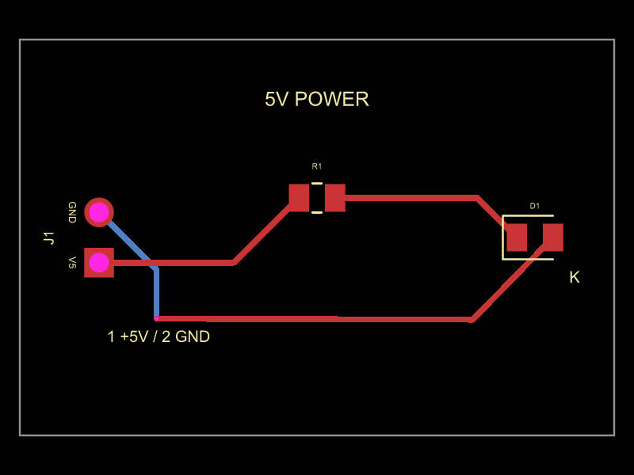 | 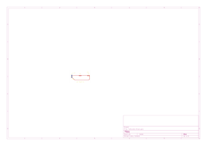 |
| rc-low-pass | 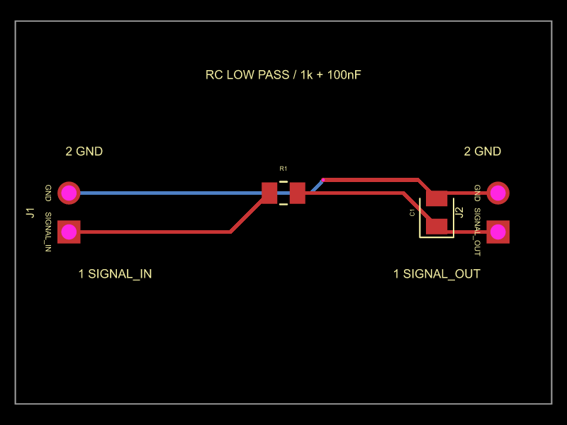 | 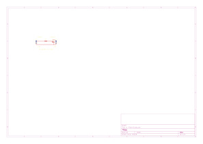 |
| voltage-divider | 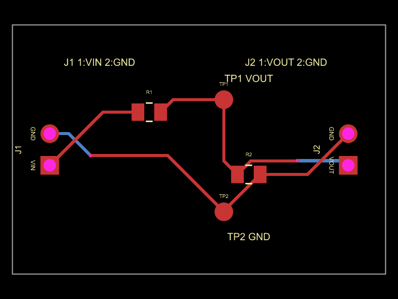 | 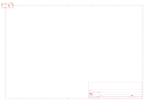 |
| button-input-bank | 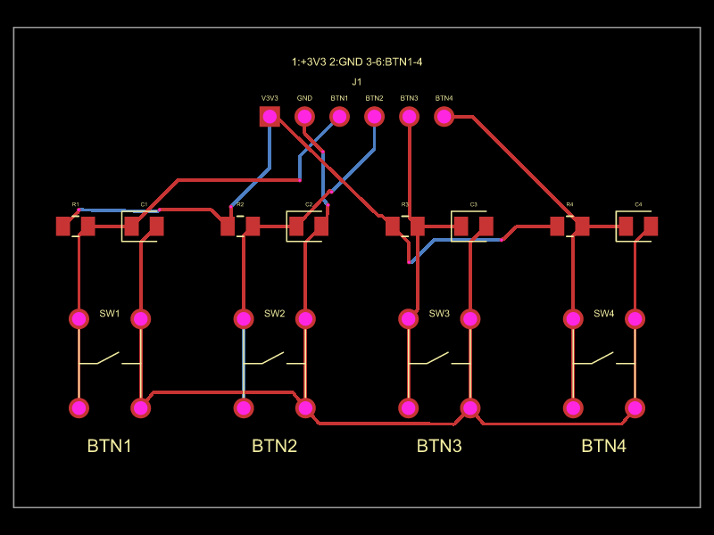 | 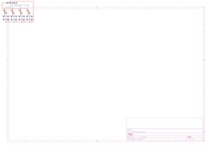 |
| i2c-pullup-hub | 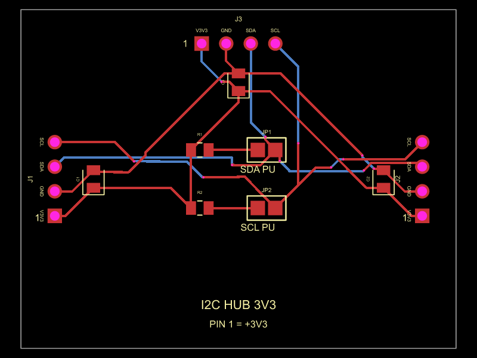 | [Native files](../../data/runs/2026-09-05-codegen-pilot-01/i2c-pullup-hub/kicad-codegen/replicate-1/artifacts/README.md) |
| npn-led-driver | 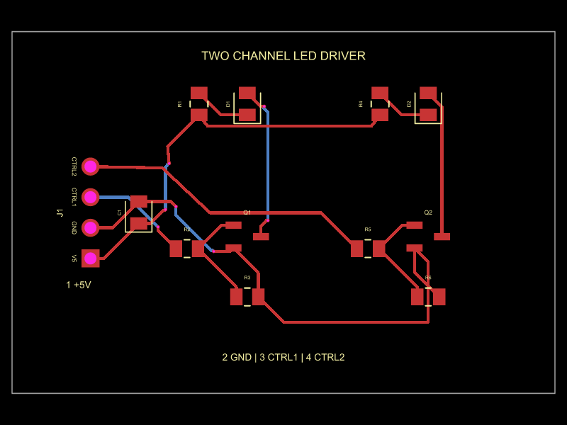 | 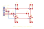 |
| stereo-passive-attenuator | 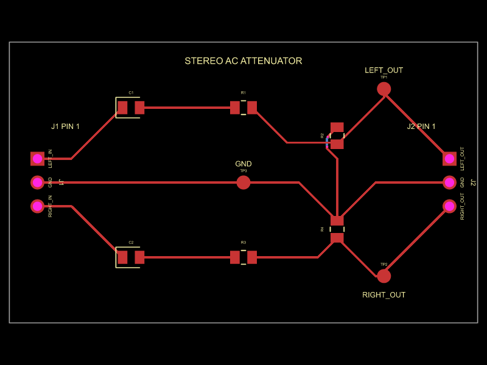 | 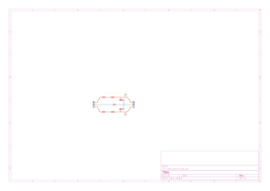 |
| analog-input-bank | 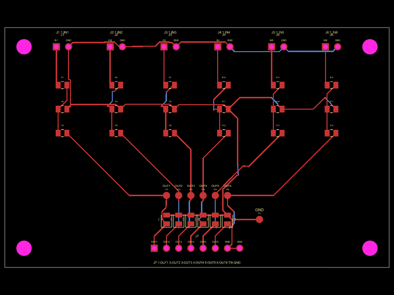 | 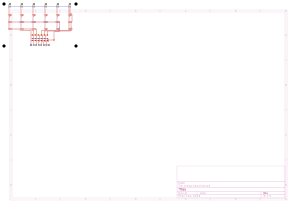 |
| diode-key-matrix | 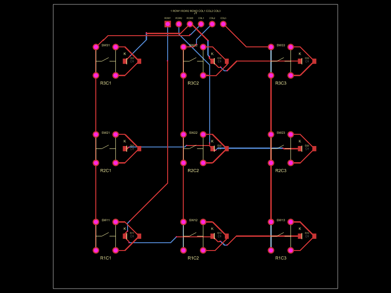 | 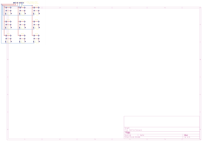 |
| mosfet-output-bank | 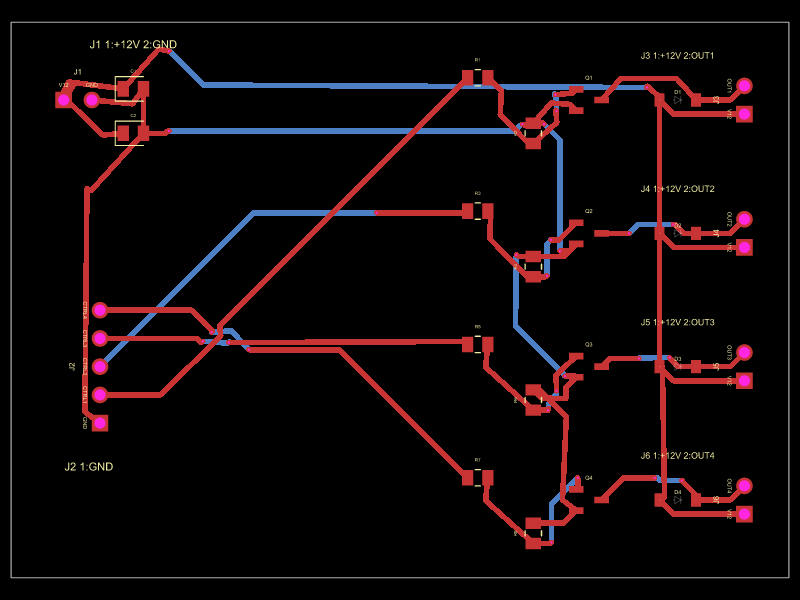 | 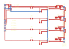 |

## Recorded limitations

**led-indicator / kicad-codegen**

- Generic red 0805 LED; manufacturer part number and physical operation untested.
- B.Cu is unused; all routing is on F.Cu.
- KiCad Python emitted a nonfatal wxApp initialization assertion; raw diagnostic retained.

**led-indicator / tscircuit-codegen**

- No schematic-sheet drawing area, though schematic preview is readable.
- Independent full copper clearance and physical testing are unmeasured.
- Generic red LED and header have no manufacturer SKU.
- Parent generation reused orchestration context after the agent thread limit.

**rc-low-pass / kicad-codegen**

- No physical testing or simulation.
- No visual GUI review; native SVG exports retained.
- Generic standard library components; exact manufacturer parts unspecified.
- Library tables contain machine-specific installed library paths.
- Headless pcbnew wxApp assertion diagnostic retained; CLI validation exits zero.
- Default KiCad ignored checks recorded verbatim in ERC and DRC JSON.

**rc-low-pass / tscircuit-codegen**

- Build warning: no explicit schematicsheet drawing area.
- Generic component values and footprints; procurement-specific parts not selected.
- Geometry audit uses circuit JSON and simple shape models, not independent manufacturing DRC.
- Installed environment preserved by global lockfile snapshot and local node_modules symlink.
- Manufacturing exports and physical testing not performed (not required).

**voltage-divider / kicad-codegen**

- Library tables contain machine-specific paths.
- Generic components; no physical testing or independent visual review.
- Headless pcbnew emits a wxApp diagnostic despite successful commands.
- Parent generation reused orchestration context after the agent thread limit.

**voltage-divider / tscircuit-codegen**

- Compiled clearance metadata retains defaults; physical geometry check passed 0.25 mm. Revalidate after edits/regeneration.
- Missing testpoint courtyards and explicit schematicsheet warning.
- No physical testing or visual review.

**button-input-bank / kicad-codegen**

- Generic standard switch footprint; no manufacturer part number selected.
- SVG exports not visually inspected.
- Library tables use installed absolute paths.
- No physical testing or manufacturing validation performed.

**button-input-bank / tscircuit-codegen**

- J1 schematic box too wide warning remains in selected attempt despite exit code 0.
- Automatic J1 supplier footprint mismatch; generic 2.54 mm through-hole header is the design intent, not the auto-selected supplier item.
- Minimum physical copper clearance and independent geometric opens check are unmeasured; configured clearances are 0.25 mm.
- Generic switch footprint requires a matching physical normally-open momentary component with 1/2 and 3/4 internal terminal pairs.
- Attempt 3 has an empty schematic preview and is not selected; original artifacts retained.

**i2c-pullup-hub / kicad-codegen**

- Physical testing, fabrication, assembly, and visual rendering review not performed.
- Generation script contains the local KiCad installation path; native project library paths are relative.

**i2c-pullup-hub / tscircuit-codegen**

- Full 0.25 mm copper clearance unmeasured; emitted board has 0.1 mm default trace-to-pad and pad-to-pad clearance fields despite attempted source settings.
- Final source has harmless React key warnings and compiled jumper pin-attribute, unnamed-trace and missing-sheet warnings.
- Schematic heading close to J1 label.
- No independent physical connectivity/manufacturing checks; generic component footprints, no supplier MPNs.

**npn-led-driver / kicad-codegen**

- Native schematic parity reports 28 net-name warnings because local schematic names have a leading / and PCB names do not; normalized pin groups agree exactly.
- Schematic value/label overlap around Q1/Q2 and D1/D2 reduces readability.
- No physical testing or simulation; a specific red LED ordering code was not selected.

**npn-led-driver / tscircuit-codegen**

- Independent full geometric copper clearance validation not performed.
- Open-net audit uses compiled connectsTo metadata rather than independent copper continuity.
- Transistors use labelled schematic boxes; no electrical simulation.
- React key and unspecified electrical pin classification warnings retained.
- Generic red LEDs and passives have no manufacturer SKU; no manufacturing exports or physical testing.

**stereo-passive-attenuator / kicad-codegen**

- No physical testing or manufacturing exports; no simulation or exact manufacturer component selection.
- Native SVG exports not visually inspected.
- KiCad Python runtime emitted nonfatal wxApp assertion diagnostic, retained in generation log.
- Default ignored checks listed in native reports; no custom exclusions added.

**stereo-passive-attenuator / tscircuit-codegen**

- Full 0.25 mm copper clearance unverified; compiled board clearance fields retain 0.1 mm defaults despite source routingTolerances.
- No explicit schematic sheet; testpoints have no courtyard.
- First two shorts invocations used a wrong generated JSON path; preserved failures, corrected final invocation.
- Generic component choices; no manufacturer part numbers.

**analog-input-bank / kicad-codegen**

- Copper clearance requirement violated: native report actual 0.1868 mm. Report used 0.20 mm rather than intended 0.25 mm, so additional sub-0.25 mm spacing may exist.
- Via overlaps J6 GND drilled hole.
- ERC off-grid and library configuration warnings.
- Small silkscreen text warnings and missing configured library tables.
- Native schematic/PCB UUID parity not checked.
- Both repair allowances exhausted by initial pcbnew API execution failures.

**analog-input-bank / tscircuit-codegen**

- 0.25 mm minimum copper clearance not independently verified; compiled board retains smaller default clearance settings despite source request.
- All-net physical continuity not independently measured; router output contains traces and no generation errors.
- Seven missing testpoint-courtyard warnings and missing schematic-sheet warning remain.
- Some silkscreen labels are small/crowded; no exhaustive silkscreen DRC.

**diode-key-matrix / kicad-codegen**

- KiCad skips local library tables as UNINITIALIZED: 38 ERC and 19 DRC library warnings remain. Native embedded design data is intact.
- Generic tactile switch vendor selection is unspecified; use documented pad arrangement.
- No physical testing or rendered-image visual inspection.

**diode-key-matrix / tscircuit-codegen**

- One unresolved pad-to-trace clearance error: 0.227 mm versus required 0.25 mm.
- Missing schematic-sheet styling warning; React list-key warnings.
- Generic momentary-switch footprint specified without manufacturer-specific part selection.
- Route connectivity audit uses route metadata, not independent geometric opens testing.

**mosfet-output-bank / kicad-codegen**

- Native library tables use local absolute paths; another installation may require path changes.
- Capacitor procurement part numbers and effective capacitance under DC bias were not assessed.
- No hardware tests, thermal measurements, simulation or assembly validation performed.
- Grid router creates many short editable track segments.

**mosfet-output-bank / tscircuit-codegen**

- Nine trace clearance errors and two via-trace clearance errors remain; 0.25 mm minimum clearance requirement is not met.
- Schematic placement reports box padding and trace simplification issues despite exit 0.
- Independent copper continuity and manufacturing DRC were not performed.
- Capacitor exact manufacturer part numbers and DC bias curves not selected.
- MOSFETs represented as explicit pin-mapped chip boxes rather than transistor symbols.

